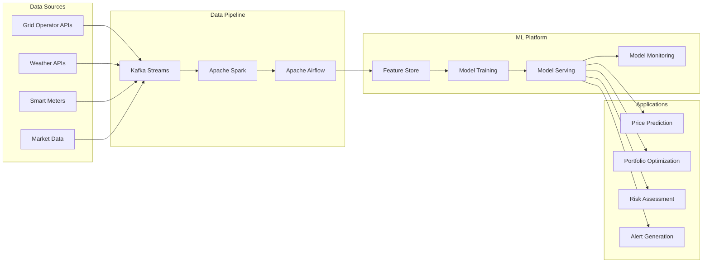
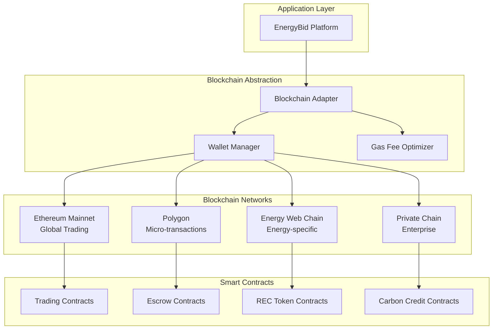

# EnergyBid Production Architecture

## 🏗️ **System Architecture Overview**

```mermaid
graph TB
    %% Frontend Layer
    subgraph "Frontend Layer"
        WEB[Web Application<br/>Next.js/React]
        MOBILE[Mobile Apps<br/>React Native]
        API_DOCS[API Documentation<br/>OpenAPI/Swagger]
    end

    %% API Gateway & Load Balancer
    subgraph "API Gateway"
        LB[Load Balancer<br/>NGINX/CloudFlare]
        GW[API Gateway<br/>Kong/AWS API Gateway]
        RATE[Rate Limiting<br/>& Authentication]
    end

    %% Microservices Layer
    subgraph "Microservices"
        AUTH[Auth Service<br/>JWT/OAuth]
        USER[User Service<br/>Profiles/KYC]
        TRADING[Trading Service<br/>Auctions/Bids]
        MARKET[Market Data Service<br/>Real-time Pricing]
        PAYMENT[Payment Service<br/>Stripe/ACH]
        NOTIFY[Notification Service<br/>WebSocket/Push]
        AI[AI/ML Service<br/>Forecasting]
        BLOCKCHAIN[Blockchain Service<br/>Smart Contracts]
        COMPLIANCE[Compliance Service<br/>Reporting/AML]
    end

    %% Data Layer
    subgraph "Data Storage"
        POSTGRES[(PostgreSQL<br/>Primary DB)]
        REDIS[(Redis<br/>Cache/Sessions)]
        MONGO[(MongoDB<br/>Documents)]
        INFLUX[(InfluxDB<br/>Time Series)]
        ELASTIC[(Elasticsearch<br/>Search/Analytics)]
    end

    %% External APIs
    subgraph "External Integrations"
        CAISO[CAISO API<br/>California Grid]
        ERCOT[ERCOT API<br/>Texas Grid]
        PJM[PJM API<br/>Eastern Grid]
        WEATHER[Weather APIs<br/>Forecasting]
        STRIPE_API[Stripe API<br/>Payments]
        SMART_METERS[Smart Meter APIs<br/>Consumption Data]
    end

    %% Blockchain Layer
    subgraph "Blockchain Infrastructure"
        ETH[Ethereum<br/>Mainnet]
        POLYGON[Polygon<br/>L2 Solution]
        EWC[Energy Web Chain<br/>Specialized]
        IPFS[IPFS<br/>Document Storage]
    end

    %% Message Queue & Streaming
    subgraph "Message Infrastructure"
        KAFKA[Apache Kafka<br/>Event Streaming]
        RABBIT[RabbitMQ<br/>Message Queue]
        WEBSOCKET[WebSocket Server<br/>Real-time Updates]
    end

    %% AI/ML Infrastructure
    subgraph "AI/ML Platform"
        ML_PIPELINE[MLOps Pipeline<br/>MLflow/Kubeflow]
        MODEL_SERVE[Model Serving<br/>TensorFlow Serving]
        FEATURE_STORE[Feature Store<br/>ML Features]
        DATA_LAKE[Data Lake<br/>AWS S3/Azure]
    end

    %% Monitoring & Logging
    subgraph "Observability"
        PROMETHEUS[Prometheus<br/>Metrics]
        GRAFANA[Grafana<br/>Dashboards]
        ELK[ELK Stack<br/>Logging]
        JAEGER[Jaeger<br/>Tracing]
    end

    %% Connections
    WEB --> LB
    MOBILE --> LB
    LB --> GW
    GW --> RATE

    RATE --> AUTH
    RATE --> USER
    RATE --> TRADING
    RATE --> MARKET
    RATE --> PAYMENT
    RATE --> NOTIFY
    RATE --> AI
    RATE --> BLOCKCHAIN
    RATE --> COMPLIANCE

    AUTH --> POSTGRES
    USER --> POSTGRES
    TRADING --> POSTGRES
    MARKET --> INFLUX
    PAYMENT --> POSTGRES

    AUTH --> REDIS
    MARKET --> REDIS
    NOTIFY --> REDIS

    USER --> MONGO
    COMPLIANCE --> MONGO

    MARKET --> ELASTIC
    AI --> ELASTIC

    TRADING --> KAFKA
    MARKET --> KAFKA
    NOTIFY --> KAFKA

    MARKET --> CAISO
    MARKET --> ERCOT
    MARKET --> PJM
    MARKET --> WEATHER
    PAYMENT --> STRIPE_API
    MARKET --> SMART_METERS

    BLOCKCHAIN --> ETH
    BLOCKCHAIN --> POLYGON
    BLOCKCHAIN --> EWC
    BLOCKCHAIN --> IPFS

    AI --> ML_PIPELINE
    AI --> MODEL_SERVE
    AI --> FEATURE_STORE
    AI --> DATA_LAKE

    ALL_SERVICES --> PROMETHEUS
    PROMETHEUS --> GRAFANA
    ALL_SERVICES --> ELK
    ALL_SERVICES --> JAEGER
```



## 🔧 **Core Infrastructure Components**

### **1. Frontend Architecture**
- **Next.js 15** with server-side rendering for SEO and performance
- **Progressive Web App** (PWA) capabilities for mobile-like experience
- **Real-time updates** via WebSocket connections
- **Responsive design** with Tailwind CSS and shadcn/ui
- **State management** with Zustand or Redux Toolkit
- **Offline support** for critical trading functions

### **2. API Gateway & Security**
- **Kong or AWS API Gateway** for request routing and management
- **Rate limiting** to prevent abuse and ensure fair usage
- **Authentication middleware** with JWT token validation
- **CORS configuration** for cross-origin requests
- **API versioning** for backward compatibility
- **Request/response logging** for audit trails

### **3. Microservices Architecture**

#### **Authentication Service**
- OAuth 2.0/OIDC integration with enterprise SSO
- Multi-factor authentication (MFA)
- Session management with Redis
- Role-based access control (RBAC)
- Password policies and rotation

#### **Trading Service**
- Auction management and lifecycle
- Bid processing and validation
- Order matching algorithms
- Position tracking and management
- Risk limits and circuit breakers

#### **Market Data Service**
- Real-time price feed processing
- Historical data aggregation
- Market analytics and calculations
- Grid status monitoring
- Weather data integration

#### **Payment Service**
- Multiple payment method support
- Escrow management
- Financial reconciliation
- Fraud detection
- PCI DSS compliance

### **4. Data Architecture**

#### **PostgreSQL (Primary Database)**
```sql
-- Core tables structure
Tables:
├── users (profiles, authentication)
├── energy_blocks (available energy inventory)
├── auctions (trading sessions)
├── bids (user bids and orders)
├── transactions (completed trades)
├── payments (financial transactions)
├── contracts (smart contract references)
└── audit_logs (compliance tracking)
```

#### **Redis (Caching & Sessions)**
- Session storage and management
- Real-time market data caching
- Rate limiting counters
- WebSocket connection management
- Pub/Sub for real-time notifications

#### **InfluxDB (Time Series)**
- Energy consumption data
- Price history and trends
- Grid performance metrics
- Weather data storage
- IoT sensor data

### **5. Real-Time Data Pipeline**

#### **Apache Kafka Architecture**
```
Topics:
├── market-data (price updates, grid status)
├── user-events (bids, trades, login events)
├── notifications (alerts, system messages)
├── audit-events (compliance, security logs)
└── ai-predictions (ML model outputs)
```

#### **WebSocket Management**
- Connection pooling for scalability
- Room-based messaging for targeted updates
- Heartbeat/keepalive for connection health
- Automatic reconnection handling
- Message queuing for offline clients

## 🤖 **AI/ML Production Pipeline**

### **Data Processing Flow**


### **ML Model Types**

#### **Price Forecasting Models**
- **LSTM networks** for time series prediction
- **Random Forest** for ensemble predictions
- **Prophet** for seasonal decomposition
- **XGBoost** for gradient boosting
- **Attention mechanisms** for sequence modeling

#### **Risk Assessment Models**
- **Credit scoring** for counterparty risk
- **Volatility modeling** with GARCH
- **VaR calculation** for portfolio risk
- **Anomaly detection** for fraud prevention
- **Stress testing** for extreme scenarios

## 🔗 **Blockchain Integration Architecture**

### **Multi-Chain Strategy**


### **Smart Contract Types**

#### **Energy Trading Contract**
```solidity
contract EnergyTrading {
    struct EnergyBlock {
        uint256 id;
        address producer;
        uint256 amount;     // MWh
        uint256 price;      // Wei per kWh
        uint256 timestamp;
        bool active;
    }

    mapping(uint256 => EnergyBlock) public energyBlocks;
    mapping(uint256 => address) public highestBidder;
    mapping(uint256 => uint256) public highestBid;

    function placeBid(uint256 blockId) external payable;
    function finalizeAuction(uint256 blockId) external;
    function withdrawFunds() external;
}
```

## 🚀 **Deployment & DevOps**

### **Kubernetes Architecture**
```yaml
# Example deployment structure
apiVersion: apps/v1
kind: Deployment
metadata:
  name: energybid-trading-service
spec:
  replicas: 3
  selector:
    matchLabels:
      app: trading-service
  template:
    metadata:
      labels:
        app: trading-service
    spec:
      containers:
      - name: trading-service
        image: energybid/trading-service:v1.0.0
        ports:
        - containerPort: 3000
        env:
        - name: DATABASE_URL
          valueFrom:
            secretKeyRef:
              name: db-secret
              key: url
        resources:
          requests:
            memory: "256Mi"
            cpu: "250m"
          limits:
            memory: "512Mi"
            cpu: "500m"
```

### **CI/CD Pipeline**
```yaml
# GitHub Actions workflow
name: Deploy to Production
on:
  push:
    branches: [main]

jobs:
  test:
    runs-on: ubuntu-latest
    steps:
      - uses: actions/checkout@v2
      - name: Run tests
        run: |
          npm test
          npm run e2e
          npm run security-scan

  build:
    needs: test
    runs-on: ubuntu-latest
    steps:
      - name: Build Docker images
        run: docker build -t energybid/app:${{ github.sha }} .
      - name: Push to registry
        run: docker push energybid/app:${{ github.sha }}

  deploy:
    needs: build
    runs-on: ubuntu-latest
    steps:
      - name: Deploy to Kubernetes
        run: |
          kubectl set image deployment/energybid-app \
            app=energybid/app:${{ github.sha }}
          kubectl rollout status deployment/energybid-app
```

## 📊 **Monitoring & Observability**

### **Metrics & Alerts**
```yaml
# Prometheus rules
groups:
- name: energybid.rules
  rules:
  - alert: HighErrorRate
    expr: rate(http_requests_total{status=~"5.."}[5m]) > 0.1
    labels:
      severity: warning
    annotations:
      summary: High error rate detected

  - alert: DatabaseConnectionLow
    expr: postgresql_connections_active / postgresql_connections_max > 0.8
    labels:
      severity: critical
    annotations:
      summary: Database connection pool nearly exhausted
```

### **Logging Strategy**
```json
{
  "timestamp": "2024-01-15T10:30:00Z",
  "level": "INFO",
  "service": "trading-service",
  "traceId": "abc123def456",
  "userId": "user_789",
  "action": "place_bid",
  "auctionId": "auction_123",
  "bidAmount": 15.5,
  "bidPrice": 0.012,
  "result": "success"
}
```

## 🔒 **Security Architecture**

### **Security Layers**
1. **Network Security**: VPC, firewalls, DDoS protection
2. **Application Security**: Input validation, output encoding
3. **Data Security**: Encryption at rest and in transit
4. **Identity Security**: MFA, SSO, privilege management
5. **Monitoring Security**: SIEM, threat detection
6. **Compliance Security**: Audit logs, regulatory reporting

### **Threat Model**
- **External threats**: DDoS, injection attacks, credential stuffing
- **Internal threats**: Privilege escalation, data exfiltration
- **Financial threats**: Payment fraud, market manipulation
- **Operational threats**: System failures, data corruption
- **Regulatory threats**: Compliance violations, audit failures

---

**🎯 This architecture provides enterprise-grade scalability, security, and reliability required for a production energy trading platform handling billions of dollars in transactions.**
