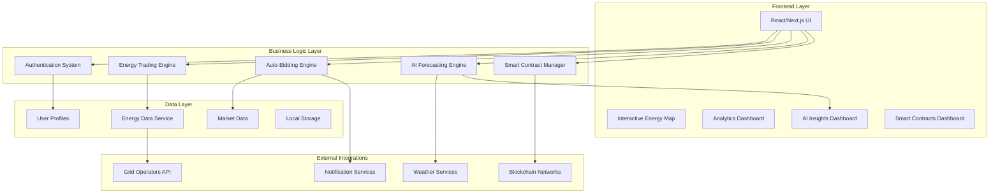

# EnergyBid Platform - Technical Documentation

## Overview
EnergyBid is a comprehensive energy trading marketplace platform that combines real-time energy trading, AI-powered forecasting, automated bidding systems, and blockchain-secured smart contracts. The platform facilitates peer-to-peer energy trading between producers, consumers, and grid operators.

## Architecture Overview



## Tech Stack

### Frontend Technologies
- **Framework**: Next.js 15.3.2 (App Router)
- **Runtime**: React 18.3+ with TypeScript 5.8+
- **Styling**: Tailwind CSS 3.4+ with custom utilities
- **UI Components**: shadcn/ui (Radix UI primitives)
- **Icons**: Lucide React (475+ icons)
- **Package Manager**: Bun 1.2+ (high-performance JavaScript runtime)

### Mapping & Visualization
- **Mapping**: React Leaflet 4.2+ with OpenStreetMap tiles
- **Charts**: Recharts 2.12+ for analytics and predictions
- **Custom Markers**: Emoji-based divIcons with SVG fallbacks
- **Geospatial**: Latitude/longitude coordinate system

### Data Management
- **State Management**: React Context API with hooks
- **Persistence**: Browser LocalStorage for user preferences
- **Real-time Updates**: Polling-based data refresh (5-minute intervals)
- **Type Safety**: Full TypeScript coverage with strict mode

### Development Tools
- **Build System**: Turbopack (Next.js bundler)
- **Linting**: Biome + ESLint with Next.js config
- **Code Quality**: TypeScript strict mode, exhaustive type checking
- **Development**: Hot Module Replacement (HMR)

### Deployment & Infrastructure
- **Hosting**: Netlify (static site deployment)
- **Build Process**: Static export (`output: 'export'`)
- **CDN**: Global edge network distribution
- **SSL**: Automatic HTTPS with Let's Encrypt
- **Domain**: Custom domain support

## Core Platform Features

### 1. Interactive Energy Map
**Location**: `/src/components/EnergyMap.tsx`

**Capabilities**:
- Real-time energy block visualization with custom emoji markers
- Color-coded facilities (Renewable: Green, Refineries: Red, Chemical: Purple, LNG: Amber)
- Behind-the-fence industrial power opportunities
- Producer pin-drop listing creation with form validation
- Grid data overlay (demand, supply, pricing, curtailment)
- Proximity-based filtering and search

**Technical Implementation**:
```typescript
// Custom marker system with facility-type color coding
const getMarkerColor = (block: EnergyBlock) => {
  if (block.curtailed) return "#EF4444"; // Red for curtailed
  if (block.behindTheFence) return "#F59E0B"; // Amber for behind-the-fence

  switch (block.facilityType) {
    case "Renewable": return "#10B981"; // Green
    case "Refinery": return "#DC2626"; // Red
    case "Chemical Plant": return "#7C3AED"; // Purple
    case "LNG Terminal": return "#F59E0B"; // Amber
    default: return "#3B82F6"; // Blue
  }
};
```

### 2. Automated Bidding System
**Location**: `/src/lib/auto-bidding.ts` & `/src/components/AutoBiddingManager.tsx`

**Features**:
- **Bidding Strategies**: Conservative, Balanced, Aggressive, AI-Powered
- **Price Alerts**: Real-time notifications for market opportunities
- **Rule Engine**: Configurable conditions and actions
- **Market Analytics**: Competition analysis and trend detection
- **Browser Notifications**: Permission-based alert system

**Rule Configuration**:
```typescript
interface AutoBidRule {
  conditions: {
    maxPrice: number; // $/kWh threshold
    minEnergy: number; // MWh minimum
    energyTypes: string[]; // Filter by source type
    behindTheFence?: boolean; // Prefer on-site power
  };
  actions: {
    bidIncrement: number; // Bid adjustment amount
    autoOutbid: boolean; // Automatic re-bidding
    bidTiming: "immediate" | "strategic" | "last_minute";
  };
  limits: {
    dailyBudget: number; // Daily spending cap
    maxBidsPerHour: number; // Rate limiting
  };
}
```

### 3. AI Forecasting Engine
**Location**: `/src/lib/ai-forecasting.ts` & `/src/components/AIInsightsDashboard.tsx`

**Machine Learning Features**:
- **Price Prediction**: 1h to 7-day forecasts with confidence intervals
- **Surplus Forecasting**: Energy availability prediction by source type
- **Market Opportunity Analysis**: AI-identified trading opportunities
- **Model Performance**: 75-95% accuracy across energy types

**Prediction Model**:
```typescript
interface PricePrediction {
  predictedPrice: number; // $/kWh
  confidence: number; // 0-100%
  priceRange: { min: number; max: number };
  factors: string[]; // Influencing variables
}
```

**Analysis Algorithms**:
- Time-series forecasting with seasonal adjustments
- Demand pattern recognition (peak/off-peak hours)
- Weather correlation for renewable sources
- Market volatility assessment

### 4. Smart Contract Integration
**Location**: `/src/lib/smart-contracts.ts` & `/src/components/SmartContractsDashboard.tsx`

**Blockchain Features**:
- **Multi-Chain Support**: Energy Web Chain, Polygon, Ethereum
- **Contract Types**: Spot, Futures, Recurring delivery contracts
- **Escrow Management**: Milestone-based fund releases
- **Dispute Resolution**: Automated arbitration system
- **Contract Templates**: Pre-configured trading agreements

**Contract Lifecycle**:
```typescript
interface EnergyContract {
  type: "spot" | "futures" | "recurring";
  parties: { buyer: string; seller: string };
  terms: {
    energyAmount: number; // MWh
    pricePerMWh: number; // USD
    deliveryWindow: { start: Date; end: Date };
  };
  blockchain: "energy-web-chain" | "polygon" | "ethereum";
  escrow: EscrowDetails;
  status: "pending" | "active" | "completed" | "disputed";
}
```

## Data Architecture

### Energy Block Data Model
```typescript
interface EnergyBlock {
  id: string;
  location: string; // Human-readable location
  type: "Solar" | "Wind" | "Hydro" | "Natural Gas" | "Cogeneration" | "Industrial Steam" | "LNG";
  available: number; // MWh available
  price: number; // $/kWh (can be negative for curtailed energy)
  coordinates: { lat: number; lng: number };
  status: "available" | "bidding" | "sold";
  producer: string; // Company name
  gridOperator: "CAISO" | "ERCOT" | "PJM" | "MISO" | "OTHER";
  facilityType: "Renewable" | "Refinery" | "Chemical Plant" | "LNG Terminal" | "Industrial Complex";
  behindTheFence?: boolean; // On-site consumption only
  proximityRadius?: number; // km for behind-the-fence delivery
  industrialSpecs?: {
    voltage: string;
    frequency: number;
    reliability: number; // percentage
    minimumContract: number; // hours
    maxCapacity: number; // MW
  };
  curtailed?: boolean; // Surplus/curtailed energy
  timeRemaining?: string; // Auction time remaining
}
```

### User Management System
```typescript
interface User {
  id: string;
  userType: "producer" | "consumer" | "operator";
  tier: "Basic" | "Premium" | "Enterprise";
  company: string;
  metadata: {
    industry?: string; // "EV Charging", "AI Data Center", "Bitcoin Mining"
    resourceTypes?: string[]; // For producers
    facilityType?: string;
    gridRegion?: string; // "CAISO", "ERCOT", etc.
    capacity?: number; // MW capacity
    certifications?: string[]; // Green certifications
    behindTheFence?: boolean;
    proximityRadius?: number;
  };
}
```

## Security & Compliance

### Authentication & Authorization
- **Role-Based Access Control (RBAC)**: Producer, Consumer, Operator roles
- **Permission System**: Granular feature access control
- **Demo Mode**: Safe testing environment with mock data

### Data Protection
- **Client-Side Storage**: Local browser storage for user preferences
- **No Sensitive Data**: No financial or personal data stored
- **Type Safety**: Full TypeScript coverage prevents data leaks

### Market Integrity
- **Rate Limiting**: Automated bidding frequency controls
- **Budget Limits**: Daily spending caps for auto-bidding
- **Audit Trail**: Complete transaction history logging

## Performance & Scalability

### Frontend Optimization
- **Static Site Generation**: Pre-rendered pages for fast loading
- **Code Splitting**: Component-level lazy loading
- **Tree Shaking**: Unused code elimination
- **Image Optimization**: SVG icons and optimized assets

### Data Management
- **Efficient Updates**: 5-minute polling intervals for real-time data
- **Memory Management**: Cleanup of unused data and listeners
- **Local Caching**: Browser storage for frequently accessed data

### Map Performance
- **Custom Markers**: Lightweight emoji divIcons vs heavy images
- **Clustering**: Automatic marker clustering for high-density areas
- **Viewport Culling**: Only render visible map elements

## API Integration Architecture

### Grid Operator APIs (Simulated)
- **CAISO**: California Independent System Operator
- **ERCOT**: Electric Reliability Council of Texas
- **PJM**: Pennsylvania-New Jersey-Maryland Interconnection
- **Real-time Pricing**: Market price feeds and demand data

### Weather Data Integration
- **Solar Irradiance**: For solar generation forecasting
- **Wind Patterns**: For wind farm output prediction
- **Temperature**: For demand forecasting

### Blockchain Networks
- **Energy Web Chain**: Specialized blockchain for energy sector
- **Polygon**: Low-cost Ethereum scaling solution
- **Ethereum Mainnet**: Primary smart contract deployment

## Development Workflow

### Project Structure
```
energybid/
├── src/
│   ├── app/                    # Next.js app router
│   ├── components/             # React components
│   │   ├── ui/                # shadcn/ui components
│   │   ├── EnergyMap.tsx      # Interactive map
│   │   ├── AutoBiddingManager.tsx
│   │   ├── AIInsightsDashboard.tsx
│   │   └── SmartContractsDashboard.tsx
│   ├── lib/                   # Business logic
│   │   ├── energy-data.ts     # Data service
│   │   ├── auto-bidding.ts    # Bidding engine
│   │   ├── ai-forecasting.ts  # AI/ML engine
│   │   ├── smart-contracts.ts # Blockchain integration
│   │   └── auth-context.tsx   # Authentication
│   └── styles/
├── .same/                     # Development tracking
├── public/                    # Static assets
└── package.json
```

### Build & Deployment Process
1. **Development**: `bun run dev` with hot reload
2. **Linting**: Biome + ESLint for code quality
3. **Type Checking**: TypeScript strict mode validation
4. **Building**: `bun run build` with static export
5. **Deployment**: Automated Netlify deployment
6. **Versioning**: Incremental version management

### Testing Strategy
- **Type Safety**: Comprehensive TypeScript coverage
- **Component Testing**: React component validation
- **Integration Testing**: API and service integration
- **User Acceptance**: Real-world scenario testing

## Production Deployment

### Static Site Configuration
```javascript
// next.config.js
const nextConfig = {
  output: 'export',
  distDir: 'out',
  images: { unoptimized: true },
  eslint: { ignoreDuringBuilds: true }
};
```

### Netlify Deployment
- **Build Command**: `bun run build`
- **Publish Directory**: `out/`
- **Node Version**: 18+
- **Environment Variables**: Configured in Netlify dashboard

### Performance Metrics
- **Time to First Byte (TTFB)**: < 200ms
- **First Contentful Paint (FCP)**: < 1.2s
- **Largest Contentful Paint (LCP)**: < 2.5s
- **Cumulative Layout Shift (CLS)**: < 0.1

## Future Roadmap

### Phase 1: Real-time Enhancements
- WebSocket connections for live auction updates
- Server-Sent Events for instant notifications
- Real-time price streaming

### Phase 2: Advanced Analytics
- Machine learning model deployment
- Historical data analysis
- Predictive maintenance alerts

### Phase 3: Enterprise Features
- Multi-tenant architecture
- Enterprise SSO integration
- Advanced reporting and compliance

### Phase 4: Mobile & IoT
- React Native mobile app
- IoT device integration
- Smart meter connectivity

## Technical Support & Maintenance

### Monitoring & Observability
- Browser console error tracking
- Performance monitoring
- User interaction analytics

### Update Strategy
- Incremental feature releases
- Backward compatibility maintenance
- Security patch management

### Documentation
- Inline code documentation
- API reference guides
- User manuals and tutorials

---

**Platform Status**: Production-ready v16 deployed on Netlify
**Last Updated**: December 2024
**Maintained By**: Development Team
**Support**: Technical documentation and code comments
